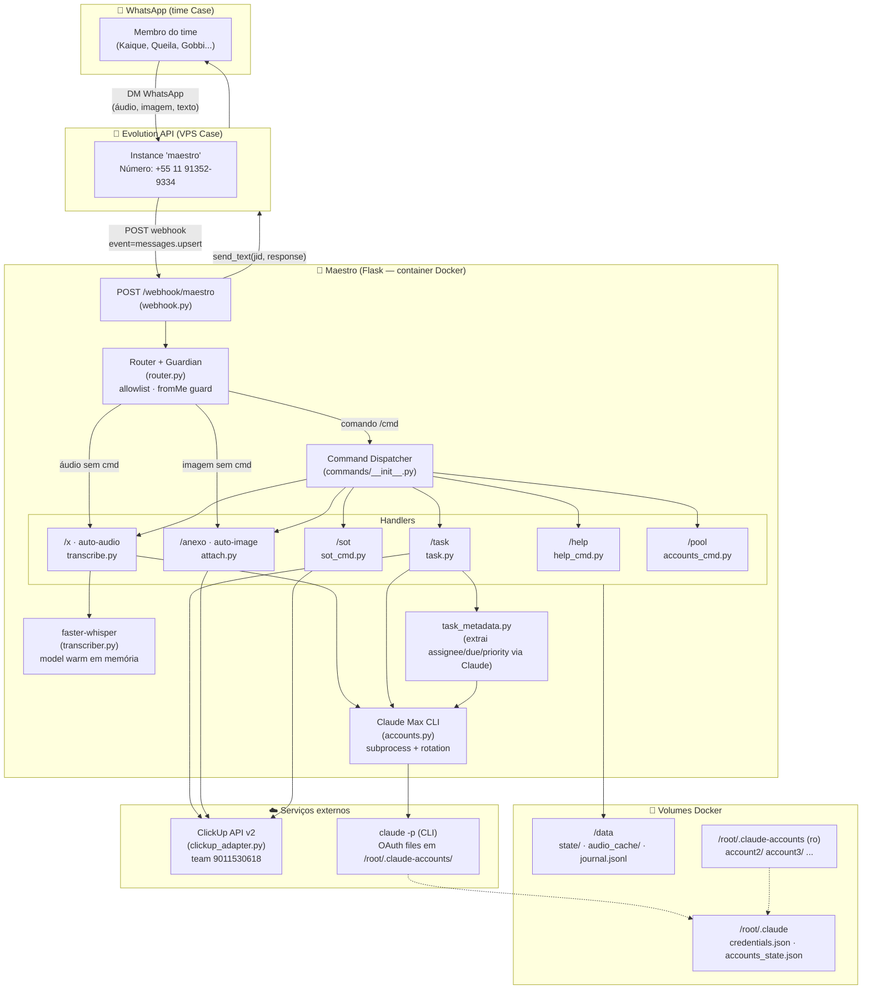
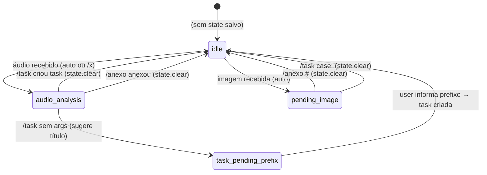
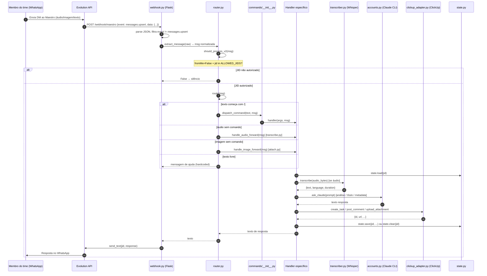
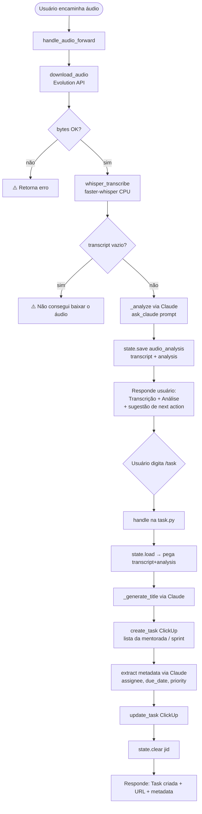

# Maestro — Handoff Técnico Completo

> Documento de transferência integral do sistema para um desenvolvedor que **nunca viu este código**.
> Cobre: arquitetura end-to-end, todos os módulos Python, integrações externas (WhatsApp via Evolution
> API, ClickUp, faster-whisper, Claude Max CLI), comandos e handlers, modelo de estado em arquivo,
> deploy em Docker Swarm, variáveis de ambiente e dívidas técnicas conhecidas.
>
> **Como ler:** comece pela §1 (visão geral) e §2 (arquitetura). Depois vá direto para a seção do
> subsistema que você vai mexer. As §13 (env vars) e §15 (dívidas/riscos) são leitura obrigatória
> antes de qualquer deploy ou alteração de lógica.

---

## Índice

1. [O que é o Maestro](#1-o-que-é-o-maestro)
2. [Arquitetura end-to-end](#2-arquitetura-end-to-end)
3. [Stack tecnológico](#3-stack-tecnológico)
4. [Inventário de serviços externos](#4-inventário-de-serviços-externos)
5. [Modelo de estado (sem banco de dados)](#5-modelo-de-estado)
6. [Storage / arquivos em volume](#6-storage--arquivos-em-volume)
7. [Pipeline principal: mensagem WhatsApp → ação](#7-pipeline-principal)
8. [Integração com IA — Claude Max CLI](#8-integração-com-ia--claude-max-cli)
9. [Comandos e handlers](#9-comandos-e-handlers)
10. [ClickUp — adapter e schema](#10-clickup--adapter-e-schema)
11. [Autenticação e autorização](#11-autenticação-e-autorização)
12. [Infra, build e deploy (Docker Swarm + Traefik)](#12-infra-build-e-deploy)
13. [Variáveis de ambiente (completo)](#13-variáveis-de-ambiente)
14. [CI/CD e observability](#14-cicd-e-observability)
15. [Dívidas técnicas e riscos conhecidos](#15-dívidas-técnicas-e-riscos-conhecidos)
16. [Apêndice — Mapa de diretórios](#16-apêndice--mapa-de-diretórios)

---

## 1. O que é o Maestro

**Maestro** é um **assistente operacional via WhatsApp** construído especificamente para o time
interno da **CASE / All In** (empresa de mentoria da Queila Trizotti). Funciona como um bot que
recebe mensagens diretas (DMs) dos membros autorizados do time e transforma conteúdo encaminhado
(áudios de mentoradas, prints, textos) em **tasks organizadas no ClickUp**.

### Problema que resolve

O time encaminha para o Maestro (via WhatsApp) áudios de mentoradas, prints de conversas ou
mensagens com demandas. O Maestro:

1. **Transcreve** áudios (faster-whisper rodando localmente no container).
2. **Analisa** o conteúdo via Claude (LLM) e extrai intenção, urgência e ações sugeridas.
3. **Cria tasks** no ClickUp no espaço correto: lista da mentorada específica (23 listas) ou
   sprint ativa do time All In.
4. **Infere metadata** da task (responsável, prazo, prioridade) via Claude e aplica na task criada.
5. **Anexa** transcrições, análises e imagens como comentários e attachments em tasks existentes.
6. **Responde** em PT-BR diretamente no WhatsApp do usuário com confirmação e link da task.

### Quem usa

Sete membros fixos do time, com JIDs hardcoded na allowlist:
- Kaique, Queila, Mariza, Gobbi, Hugo, Heitor, Lara.

Qualquer outro número que tente falar com o bot recebe silêncio (sem resposta, sem log revelador).

### Domínio de produção

`https://maestro.manager01.casein.com.br` (VPS Case, Docker Swarm + Traefik)

---

## 2. Arquitetura end-to-end



### Princípios arquiteturais que o dev precisa internalizar

1. **Stateless por request, stateful por usuário em arquivo.** Não há banco de dados. O estado
   inter-mensagens (áudio transcrito aguardando /task, imagem aguardando /anexo) vive em arquivos
   JSON por JID em `/data/state/<jid_safe>.json`. Cada request Flask lê e grava esse arquivo.

2. **Claude é um processo filho, não uma API.** A integração com LLM usa `subprocess.run` para
   chamar o binário `/usr/local/bin/claude -p <prompt>`. Não há SDK nem API key — usa OAuth
   Claude Max com arquivos de credenciais rotacionados em `/root/.claude/`.

3. **Flask é síncrono e threaded.** O servidor roda com `threaded=True`. Transcrições longas
   (faster-whisper pode demorar 10–30s em áudios longos) e chamadas Claude (30–120s) bloqueiam
   a thread do Flask. Não há fila de tarefas, Celery, ou async — o webhook HTTP espera tudo.

4. **Whisper é warm.** O modelo faster-whisper carrega uma vez (`_model` global em `transcriber.py`)
   e fica em memória RAM. First call faz load (~10–30s); chamadas subsequentes são rápidas (~5s).
   Reiniciar o container mata o warm-up.

5. **Allowlist is the only auth.** Não há tokens, sessions ou HMAC. A única proteção é a checagem
   de JID na set `ALLOWED_JIDS` + a regra `fromMe=False` (ver §11).

---

## 3. Stack tecnológico

| Camada | Tecnologia | Versão | Observação |
|---|---|---|---|
| Linguagem | Python | 3.11 (Dockerfile) | |
| Framework web | Flask | >=3.0.0 | Servidor embutido threaded |
| Transcrição de áudio | faster-whisper | >=1.0.0 | Wrapper sobre Whisper CTranslate2 |
| HTTP client | requests | >=2.31.0 | Chamadas Evolution API + ClickUp |
| Data parsing | python-dateutil | >=2.8.2 | Parsing de datas relativas no extrator de metadata |
| LLM | Claude Max CLI (`claude -p`) | latest (instalado no build) | OAuth, **não** API key |
| WhatsApp gateway | Evolution API | — (self-hosted no VPS) | REST, instance "maestro" |
| ClickUp | ClickUp API v2 | — | REST direto, sem SDK |
| Containerização | Docker + Docker Compose v3.8 | — | Deploy em Docker Swarm |
| Reverse proxy / TLS | Traefik | — (externo, no VPS) | Labels no Compose |
| Áudio (dep interna) | ffmpeg | sistema (apt) | Dep do faster-whisper |
| Áudio (aceleração) | libgomp1 | sistema (apt) | OpenMP para CTranslate2 |

**Não há:** banco de dados, Redis, ORM, SDK de IA pago, frontend, migrações, testes automatizados.

---

## 4. Inventário de serviços externos

| Serviço | Papel | Env var(s) | Obrigatório? |
|---|---|---|---|
| **Evolution API** | Gateway WhatsApp: recebe webhooks + envia mensagens | `EVOLUTION_URL`, `EVOLUTION_KEY`, `EVOLUTION_INSTANCE`, `MAESTRO_WA_JID` | **Sim** |
| **ClickUp API v2** | Criação/atualização de tasks, comments, attachments | `CLICKUP_TOKEN`, `CLICKUP_TEAM_CASE` | **Sim** |
| **Claude Max CLI** | LLM para análise de áudio, geração de título, extração de metadata | Arquivos OAuth em `/root/.claude-accounts/` (volume) | **Sim** |
| **faster-whisper (local)** | Transcrição de áudio em PT dentro do container | `WHISPER_MODEL`, `WHISPER_COMPUTE_TYPE` | **Sim** |

**Nenhuma dependência de Supabase, OpenAI, S3, Sentry ou qualquer SaaS adicional.** O sistema é
propositalmente minimalista.

---

## 5. Modelo de estado

> Maestro não tem banco de dados. O estado é persistido em arquivos JSON no volume Docker `/data/`.

### 5.1 Diagrama de estado por usuário



### 5.2 Arquivo de state por usuário

**Path:** `/data/state/<jid_safe>.json`
onde `jid_safe` = JID com `@` e `:` substituídos por `_`
(ex: `5527999087857_s.whatsapp.net.json` para Gobbi)

**Campos possíveis por tipo:**

#### Tipo `audio_analysis`
| Campo | Tipo | Descrição |
|---|---|---|
| `type` | str | `"audio_analysis"` |
| `transcript` | str | Texto transcrito pelo Whisper |
| `analysis` | str | Análise estruturada gerada pelo Claude |
| `jid` | str | JID do usuário |
| `msg_id` | str | ID da mensagem original |
| `updated_at` | int | Unix timestamp (adicionado pelo `state.save`) |

#### Tipo `pending_image`
| Campo | Tipo | Descrição |
|---|---|---|
| `type` | str | `"pending_image"` |
| `image_path` | str | Path absoluto da imagem em `/data/audio_cache/img_*.jpg` |
| `jid` | str | JID do usuário |
| `msg_id` | str | ID da mensagem original |
| `updated_at` | int | Unix timestamp |

#### Tipo `task_pending_prefix`
| Campo | Tipo | Descrição |
|---|---|---|
| `type` | str | `"task_pending_prefix"` |
| `suggested_title` | str | Título sugerido pelo Claude |
| `transcript` | str | (herdado do audio_analysis anterior) |
| `analysis` | str | (herdado do audio_analysis anterior) |
| `updated_at` | int | Unix timestamp |

### 5.3 Journal global

**Path:** `/data/journal.jsonl`
Arquivo append-only. Cada linha é um JSON com um evento. Usado como audit trail.

**Eventos registrados:**
| `event` | Quando é gravado |
|---|---|
| `audio_transcribed` | Após transcrição bem-sucedida |
| `task_created` | Após criação de task no ClickUp |
| `attach_image` | Após upload de imagem em task |
| `attach_audio` | Após post de comentário com transcrição em task |

Campos comuns: `ts` (Unix timestamp), `user` (nome do membro), `jid`, campos específicos do evento.

### 5.4 Cache de áudio

**Path:** `/data/audio_cache/<sha1_16>.ogg`
Cache de bytes de áudio baixados da Evolution API. Chave = SHA-1 truncado em 16 chars de
`"{msg_id}|{remote_jid}"`. Arquivos nunca são limpos automaticamente.

---

## 6. Storage / arquivos em volume

Três volumes Docker montados no container:

| Volume | Mount | Conteúdo | Mutabilidade |
|---|---|---|---|
| `maestro_data` | `/data` | State per-user, cache de áudio, journal | Read-Write |
| `maestro_claude` | `/root/.claude` | `maestro_accounts_state.json` (estado do pool), `.credentials.json` (conta ativa) | Read-Write |
| `maestro_logs` | `/var/log/maestro` | Logs (sem código que grave aqui por ora) | Read-Write |
| (bind host) | `/root/.claude-accounts` | `account2/`, `account3/`, ... — credentials.json por conta | Read-Only |

**Estrutura do volume `/root/.claude-accounts` (host, não gerenciado pelo código):**
```
/root/.claude-accounts/
├── account2/
│   ├── credentials.json   ← OAuth token da conta infra@queilatrizotti.com.br
│   └── claude.json        ← (opcional) config da conta
├── account3/
│   ├── credentials.json   ← OAuth token da conta adm@queilacomque.com.br
│   └── claude.json
└── accountN/              ← contas adicionais seguem o mesmo padrão
```

**Estrutura do volume `/data`:**
```
/data/
├── state/
│   └── 5511964682447_s.whatsapp.net.json   ← state de Kaique
│   └── 5527999087857_s.whatsapp.net.json   ← state de Gobbi
│   └── ...                                 ← um arquivo por membro
├── audio_cache/
│   ├── a1b2c3d4e5f6g7h8.ogg               ← áudio cacheado (sha1_16)
│   └── img_abc123def456_1717000000.jpg     ← imagem temporária (pending_image)
└── journal.jsonl                           ← audit trail append-only
```

---

## 7. Pipeline principal

### 7.1 Fluxo: mensagem WhatsApp → ação (sequence diagram)



### 7.2 Extração de mensagem (`extract_message`)

O payload Evolution API tem estrutura aninhada. `extract_message` normaliza tudo em um dict plano:

| Campo | Origem no payload | Descrição |
|---|---|---|
| `jid` | `key.remoteJid` | JID do chat (= JID do user em DM) |
| `msg_id` | `key.id` | ID único da mensagem |
| `from_me` | `key.fromMe` | `True` = Maestro enviou (não processar) |
| `sender_jid` | `key.participant` ou `key.remoteJid` | JID real do remetente |
| `push_name` | `pushName` | Nome salvo no WhatsApp |
| `text` | `conversation` / `extendedTextMessage.text` / caption | Texto extraído (múltiplas fontes) |
| `audio_ref` | `audioMessage` / `pttMessage` / quoted audio | Ref ao áudio (atual ou em reply) |
| `image_ref` | `imageMessage` | Ref à imagem |
| `forwarded` | `contextInfo.isForwarded` | Flag de mensagem encaminhada |
| `is_group` | `@g.us` em jid | Grupos são sempre ignorados em v2 |

**Áudio em quoted message:** se o usuário der reply num áudio com texto ou comando, o `audio_ref`
é extraído do `contextInfo.quotedMessage` com `source: "quoted"`.

### 7.3 Guarda de roteamento (`should_process_v2`)

A função definitiva (a v1 `should_process` é código morto mas mantido como documentação):
```
not is_group AND not from_me AND jid in ALLOWED_JIDS
```

- Grupos nunca são processados (Maestro não entra em grupos).
- `from_me=True` = o próprio Maestro enviou (resposta anterior) → ignora para evitar loops.
- `jid` precisa estar na `ALLOWED_JIDS` (set construída do env var `MAESTRO_ALLOWED_JIDS`).

### 7.4 Fluxo detalhado — Áudio de mentorada → Task ClickUp

Este é o fluxo de uso mais comum:



### 7.5 Download de áudio — estratégia com fallback

`evolution.download_audio` usa dois métodos em cascata:

1. **`get_audio_via_find`** (preferencial): `POST /chat/findMessages/{instance}` com `{where: {key: {id, remoteJid}}}` → obtém `mediaUrl` (S3 presigned) → baixa via GET. Cache em `/data/audio_cache/{sha1_16}.ogg`.
2. **`get_audio_b64_fallback`** (fallback): `POST /chat/getBase64FromMediaMessage/{instance}` → decodifica base64 inline. Timeout 90s.

Imagens usam apenas o método base64 (`download_image` chama diretamente `get_audio_b64_fallback`).

---

## 8. Integração com IA — Claude Max CLI

### 8.1 Arquitetura da integração

Maestro **não usa a Anthropic API**. Usa o **Claude CLI** (`claude -p`) instalado no container,
que autentica via **OAuth Claude Max** com arquivos de credenciais em disco.

O fluxo de chamada é sempre:
```python
subprocess.run(["/usr/local/bin/claude", "-p", prompt], capture_output=True, text=True, timeout=X)
```

Saída = stdout (ou stderr como fallback) do processo.

### 8.2 Pool de contas e rotação (accounts.py)

O Maestro suporta múltiplas contas Claude Max para contornar rate limits / caps de uso.

**State do pool:** `/root/.claude/maestro_accounts_state.json`
```json
{
  "active": "account2",
  "accounts": {
    "account2": {"email": "infra@queilatrizotti.com.br", "cooldown_until": 0},
    "account3": {"email": "adm@queilacomque.com.br", "cooldown_until": 0}
  }
}
```

**Rotação automática (`ask_claude`):**
1. Chama `claude -p <prompt>`.
2. Se output contém string de cap (`"you've hit your limit"`, `"rate limit"`, etc.) → `mark_cooldown(active, 5h)`.
3. Busca próxima conta disponível (`cooldown_until < now`).
4. `switch_to(slug)` copia `credentials.json` da conta-alvo para `/root/.claude/.credentials.json` e atualiza state.
5. Retry recursivo (`_depth` guard até esgotar contas).
6. Se todas em cooldown → retorna `"[todas contas em cooldown]"`.

**Switch manual:** `/pool switch account3` via WhatsApp, ou via `docker exec` (ver §12).

**Padrões de detecção de cap** (`CAP_PATTERNS`):
```python
"you've hit your limit", "credit balance is too low", "rate limit",
"too many requests", "quota exceeded", "usage limit reached"
```

### 8.3 Usos do Claude no sistema

| Contexto | Função chamada | Timeout | Prompt principal |
|---|---|---|---|
| Análise de áudio encaminhado | `_analyze` (transcribe.py) | 90s | Estruturado em 5 seções: Quem fala, Sobre, Pontos, Ações sugeridas, Urgência |
| Geração de título de task | `_generate_title` (task.py) | 30s | Imperativo, 6-12 palavras, max 80 chars, sem markdown |
| Extração de metadata | `task_metadata.extract` | 60s | JSON com due_date, assignee, priority, confidence, reasoning |

### 8.4 Parsing de JSON da resposta Claude (`task_metadata._parse_json`)

Claude retorna texto livre às vezes com markdown ao redor do JSON. O parser usa regex:
```python
re.search(r"\{.*\}", text, re.DOTALL)
```
Extrai o primeiro bloco `{...}` e tenta `json.loads`. Se falhar → `{"err": str(e)}`.

### 8.5 Confiança e regras de qualidade dos metadados

O prompt de extração de metadata pede um campo `confidence` (0–1) por campo. A regra:
**confidence < 0.6 → o campo é descartado** (melhor vazio que errado). Isso está documentado
no próprio prompt, mas a checagem é feita implicitamente — o Claude retorna `null` quando confiança
baixa, e `task_metadata.extract` trata null como ausente.

---

## 9. Comandos e handlers

### 9.1 Tabela de comandos

| Comando | Aliases | Handler | Arquivo | Descrição |
|---|---|---|---|---|
| `/task` | — | `task.handle` | `commands/task.py` | Cria task no ClickUp. Detecta prefixo `case:` / `allin:` |
| `/x` | `/transcrever` | `transcribe.handle_transcribe_cmd` | `commands/transcribe.py` | Mostra última transcrição ou transcreve áudio atual |
| `/anexo` | `/anexar` | `attach.handle_attach` | `commands/attach.py` | Anexa último conteúdo (áudio/imagem) em task existente |
| `/sot` | — | `sot_cmd.handle` | `commands/sot_cmd.py` | Mostra tasks ativas de uma mentorada |
| `/help` | `/ajuda` | `help_cmd.handle` | `commands/help_cmd.py` | Lista de comandos |
| `/pool` | `/accounts` | `accounts_cmd.handle` | `commands/accounts_cmd.py` | Status/gestão do pool de contas Claude |

**Auto-routing (sem `/`):**
| Conteúdo | Handler | Arquivo |
|---|---|---|
| Áudio (direto ou quoted) | `handle_audio_forward` | `commands/transcribe.py` |
| Imagem | `handle_image_forward` | `commands/attach.py` |
| Texto livre | Resposta estática de ajuda | `router.py` (inline) |

### 9.2 Comando `/task` — lógica detalhada

**Parsing de prefixo:**
- `/task case:<mentorada> <descrição>` → cria na lista da mentorada (resolve via `clickup_adapter.resolve_mentorada`)
- `/task allin:<descrição>` → cria na sprint ativa (`current_sprint_list_id()`)
- `/task sprint:<descrição>` → mesmo que `allin:`
- `/task` (sem args + state `audio_analysis` ativo) → sugere título via Claude, salva state `task_pending_prefix`, pergunta prefixo
- `/task` (sem args, sem context) → exibe lista das 23 mentoradas

**Contexto de áudio:** se houver state `audio_analysis` salvo, os campos `transcript` e `analysis`
são injetados na descrição rica da task e no prompt de geração de título. Após criar a task, o
state é limpo (`state.clear`).

**Construção da task:**
1. `create_task(list_id, name=título, description=rich_desc, status="triage")`
2. `task_metadata.extract(título, desc_hint, transcript, analysis)` → Claude infere assignee/due/priority
3. `update_task(task_id, assignees=..., due_date=..., priority=...)` (ignorado se extração falhar)
4. `state.journal({event: "task_created", ...})`

**Descrição rica** (`_build_description`):
```markdown
## Origem
<user_name> via Maestro

## Hint do usuário
<desc_hint>

## Análise
<analysis>

## Transcrição
```<transcript truncado em 2000 chars>```
```

### 9.3 Comando `/x` — transcrição

- Se a mensagem atual tem áudio → chama `handle_audio_forward` (transcreve + analisa + salva state).
- Se não tem áudio mas tem state `audio_analysis` → re-exibe última transcrição/análise (sem chamar Whisper nem Claude).
- Se nada → instrução de como usar.

### 9.4 Comando `/anexo #<task_id>` — attach

1. Parse do `task_id` (aceita com ou sem `#`).
2. `get_task(task_id)` via ClickUp (verifica se existe).
3. Se state atual é `pending_image` → lê bytes do arquivo em disco → `upload_attachment`.
4. Se state atual é `audio_analysis` → posta comment com transcrição + análise formatada em markdown.
5. Limpa state após sucesso.

### 9.5 Comando `/sot <mentorada>` — estado de tasks

Faz `GET /v2/list/{list_id}/task` com `include_closed=false` e exibe até 15 tasks ativas
formatadas com status, nome (truncado em 60 chars) e ID curto.

### 9.6 Comando `/pool` — gestão de contas Claude

Sub-comandos:
- `/pool` (sem args) → `accounts.status()` — lista contas com status (verde/vermelho) e cooldown restante
- `/pool reset` → zera todos os cooldowns (cuidado: não remove o cap real)
- `/pool switch <slug>` → força troca para conta específica

---

## 10. ClickUp — adapter e schema

### 10.1 Estrutura do espaço ClickUp (team 9011530618)

```
Team: CASE / All In (9011530618)
├── Folder: Mentorados
│   ├── list: amanda-ribeiro       (901113601831)
│   ├── list: ana-paula-jordana    (901113601883)
│   ├── list: betina-franciosi     (901113601899)
│   ├── list: camille-braganca     (901113600549)
│   ├── list: caroline-bittencourt (901113601850)
│   ├── list: daniela-morais       (901113601960)
│   ├── list: danielle-ferreira    (901113602017)
│   ├── list: danyella-truiz       (901113601230)
│   ├── list: debora-cadore        (901113601995)
│   ├── list: elina-rocha          (901113601309)
│   ├── list: jessica-crespi       (901113601481)
│   ├── list: jordanna-diniz       (901113601084)
│   ├── list: lediane-lopes        (901113601563)
│   ├── list: leticia-ambrosano    (901113601863)
│   ├── list: luciene-tamaki       (901113601793)
│   ├── list: miriam-alves         (901113601689)
│   ├── list: monica-felici        (901113628)
│   ├── list: rosalie-torrelio     (901113601168)
│   ├── list: sidney-claudia       (901113601727)
│   ├── list: tatiana-clementino   (901113601933)
│   ├── list: tayslara-belarmino   (901113601771)
│   ├── list: thiago-kailer        (901113600818)
│   └── list: vania-de-paula       (901113601747)
└── Folder: Sprint
    ├── list: sprint-4  (901113495507)  — 4/6 a 4/12
    ├── list: sprint-5  (901113526336)  — 4/13 a 4/19
    └── list: sprint-6  (901113527558)  — 4/20 a 4/26
```

⚠️ **Os IDs de sprint são hardcoded e precisam de atualização manual** quando novas sprints são
criadas pelo Gobbi (ver §15 — Dívidas Técnicas).

### 10.2 Resolução de sprint ativa (`current_sprint_list_id`)

Calcula o número da sprint com base em data:
```python
base_start = datetime(2026, 4, 6).date()
days_since = (today - base_start).days
sprint_num = 4 + (days_since // 7)
key = f"sprint-{sprint_num}"
return SPRINTS.get(key, SPRINTS["sprint-6"])  # fallback para sprint-6
```

A partir de 27/abr/2026, sprint-7 em diante não existe no dict → Maestro sempre usa sprint-6.
**Isso está quebrando silenciosamente desde ~27 de abril de 2026.**

### 10.3 Operações ClickUp implementadas

| Função | Método HTTP | Endpoint | Notas |
|---|---|---|---|
| `create_task` | POST | `/v2/list/{list_id}/task` | Suporta name, description, tags, status, assignees, due_date_ts, priority |
| `update_task` | PUT | `/v2/task/{task_id}` | Atualiza qualquer campo |
| `post_comment` | POST | `/v2/task/{task_id}/comment` | Corpo markdown (ClickUp aceita) |
| `upload_attachment` | POST | `/v2/task/{task_id}/attachment` | multipart/form-data, content-type configurável |
| `get_task` | GET | `/v2/task/{task_id}` | Retorna task completa |
| `set_custom_field` | POST | `/v2/task/{task_id}/field/{field_id}` | Erros são logados mas não propagados |

### 10.4 Assignees disponíveis (MEMBERS_ALLIN)

| Nome | User ID |
|---|---|
| queila / queila trizotti | 49138186 |
| felipe / gobbi / felipe gobbi | 230491216 |
| hugo / hugo nicchio | 3052145 |
| heitor / heitor marim | 3055979 |
| lara / lara santos | 55097238 |
| mariza / mariza ribeiro | 55020965 |
| kaique / kaique rodrigues | 3119587 |

### 10.5 Status workflow ClickUp

O schema Gobbi define o workflow de status:
`triage → backlog → ready → in progress → in review → canceled / complete`

Tasks criadas pelo Maestro sempre entram com `status="triage"`.

---

## 11. Autenticação e autorização

### 11.1 Allowlist de JIDs

A única autenticação do Maestro é a allowlist de JIDs configurada via env var:

```
MAESTRO_ALLOWED_JIDS=5511964682447@s.whatsapp.net,...
```

Carregada como `set` Python (`ALLOWED_JIDS`) no boot. `is_allowed(jid)` = `jid in ALLOWED_JIDS`.

### 11.2 Lógica de filtragem (`should_process_v2`)

```python
def should_process_v2(msg):
    if msg["is_group"]:      return False  # grupos nunca processados
    if msg["from_me"]:       return False  # mensagens do próprio bot → ignorar
    return is_allowed(msg["jid"])           # JID na allowlist?
```

Em DMs no WhatsApp, quando um usuário manda mensagem para o número do Maestro:
- `remoteJid` = JID do usuário (lado que iniciou o DM)
- `fromMe` = False (o usuário, não o Maestro, enviou)

Portanto: a checagem `is_allowed(msg["jid"])` verifica o JID do usuário que mandou.

### 11.3 Sem autenticação no endpoint HTTP

O webhook `POST /webhook/maestro` **não tem HMAC, token de header ou qualquer validação de origem**.
Qualquer requisição HTTP pode simular um evento Evolution. A proteção real está na allowlist:
um payload forjado com JID fora da allowlist é silenciosamente descartado.

⚠️ **Se um atacante conhecer um JID válido da allowlist, pode forjar comandos.** Ver §15.

### 11.4 Claude OAuth (não é autenticação de usuário)

O acesso ao Claude CLI é autenticado por conta de OAuth Claude Max. Isso não tem relação com a
autenticação dos usuários do Maestro — é a credencial do serviço para usar o LLM.

---

## 12. Infra, build e deploy

### 12.1 Topologia

```
Internet
    │
    ▼
Cloudflare / DNS
    │
    ▼
VPS Case (manager01 — IP: 178.156.157.169 aprox.)
    │
    ├── Traefik (reverse proxy, TLS Let's Encrypt)
    │       │
    │       └── Router: maestro.manager01.casein.com.br → container maestro:4300
    │
    └── Docker Swarm (modo: 1 manager, 0 workers)
            │
            ├── Stack "maestro"
            │       └── Service "maestro_maestro" (1 replica, node.role==manager)
            │               ├── Image: maestro:latest (build local)
            │               ├── Port: 4300 (interno)
            │               └── Volumes:
            │                   ├── maestro_maestro_data → /data
            │                   ├── maestro_maestro_claude → /root/.claude
            │                   ├── maestro_maestro_logs → /var/log/maestro
            │                   └── /root/.claude-accounts → /root/.claude-accounts (ro)
            │
            └── Stack "case_supabase" (Evolution API + outros serviços)
```

**Network externa:** `network_public` (Traefik está nessa rede, criada separadamente no host).

### 12.2 Dockerfile — etapas do build

1. `python:3.11-slim` como base.
2. Instala via apt: `ffmpeg`, `curl`, `ca-certificates`, `git`, `libgomp1`.
3. Instala Claude CLI via `curl -fsSL https://claude.ai/install.sh | bash -s -- latest`.
4. Symlink: `/root/.local/bin/claude → /usr/local/bin/claude`.
5. `pip install -r requirements.txt` (flask, requests, faster-whisper, python-dateutil).
6. `COPY app/ /app/`.
7. `EXPOSE 4300`.
8. `CMD ["python", "-u", "webhook.py"]`.

⚠️ **O modelo Whisper NÃO é baixado no build.** É baixado pelo faster-whisper na primeira chamada
em runtime (do Hugging Face ou cache local). Isso significa que a primeira transcrição após
um deploy cold pode demorar vários minutos.

### 12.3 Deploy (passo a passo)

```bash
# No VPS Case, /opt/maestro:
git pull                           # atualiza código
docker build -t maestro:latest .   # rebuild da imagem
docker stack deploy -c docker-compose.yml maestro --resolve-image never
# ou equivalente via install.sh:
bash deploy/install.sh
```

**`git push` NÃO faz deploy automático.** Não há CI/CD. O deploy é manual.

### 12.4 Setup inicial do webhook Evolution

```bash
bash deploy/setup-webhook.sh
```

Configura a Evolution API para enviar eventos `MESSAGES_UPSERT` para
`https://maestro.manager01.casein.com.br/webhook/maestro`.

### 12.5 Healthcheck

```
GET https://maestro.manager01.casein.com.br/health
```

Resposta:
```json
{
  "status": "ok",
  "service": "maestro",
  "allowlist_count": 7,
  "wa_jid": "5511913529334@s.whatsapp.net"
}
```

### 12.6 Comandos de operação dia a dia

```bash
# Ver logs em tempo real
docker service logs -f maestro_maestro

# Ou (se usando compose localmente):
docker compose logs -f maestro --tail=100

# Restart após mudança de código
docker compose up -d --build

# Ver state de um usuário específico
docker exec maestro cat /data/state/5527999087857_s.whatsapp.net.json

# Ver journal (últimos 100 eventos)
docker exec maestro tail -100 /data/journal.jsonl | jq .

# Status do pool Claude
docker exec maestro python3 -c "import sys; sys.path.insert(0,'/app'); import accounts; print(accounts.status())"

# Forçar switch de conta Claude
docker exec maestro python3 -c "import sys; sys.path.insert(0,'/app'); import accounts; print(accounts.switch_to('account2'))"
```

### 12.7 Adicionar nova conta Claude Max

1. Fazer OAuth flow no host (ver `oauth_direct.py` mencionado em docs/operations.md — arquivo não existe no repo ⚠️).
2. Copiar credenciais:
   ```bash
   mkdir -p /root/.claude-accounts/account5
   cp credentials.json /root/.claude-accounts/account5/
   ```
3. Editar `/root/.claude/maestro_accounts_state.json` (no volume) para incluir a nova conta.
4. `/pool switch account5` via WhatsApp para ativar.

---

## 13. Variáveis de ambiente (completo)

| Variável | Propósito | Build ou Runtime | Segredo? | Default |
|---|---|---|---|---|
| `EVOLUTION_URL` | URL base da instância Evolution API | Runtime | Não | `https://evolution.manager01.casein.com.br` |
| `EVOLUTION_KEY` | API key da Evolution API (header `apikey`) | Runtime | **Sim** | `""` |
| `EVOLUTION_INSTANCE` | Nome da instância WA no Evolution | Runtime | Não | `"maestro"` |
| `MAESTRO_WA_JID` | JID do número WhatsApp do Maestro (5511913529334@s.whatsapp.net) | Runtime | Não | `""` |
| `CLICKUP_TOKEN` | Personal API Token do ClickUp (formato `pk_XXX_YYY`) | Runtime | **Sim** | `""` |
| `CLICKUP_TEAM_CASE` | ID do team ClickUp | Runtime | Não | `"9011530618"` |
| `MAESTRO_PORT` | Porta Flask interna | Runtime | Não | `4300` |
| `MAESTRO_LOG_LEVEL` | Nível de log Python (DEBUG/INFO/WARNING) | Runtime | Não | `"INFO"` |
| `MAESTRO_ALLOWED_JIDS` | Lista de JIDs autorizados, separados por vírgula | Runtime | Não (mas sensível) | `""` |
| `WHISPER_MODEL` | Modelo faster-whisper: `tiny`, `small`, `medium`, `large-v2`, etc. | Runtime | Não | `"medium"` |
| `WHISPER_COMPUTE_TYPE` | Tipo de computação: `int8`, `float16`, `float32` | Runtime | Não | `"int8"` |

**Não configurados via env (gerenciados via volume):**
- Credenciais OAuth Claude Max: em `/root/.claude-accounts/` (bind mount read-only do host)
- Estado do pool de contas: em `/root/.claude/maestro_accounts_state.json` (volume persistente)

**Variáveis com defaults hardcoded que podem surpreender:**
- Se `EVOLUTION_KEY` for vazio, todas as chamadas à Evolution API retornarão 401 silenciosamente.
- Se `CLICKUP_TOKEN` for vazio, `r.raise_for_status()` vai lançar exceção em toda criação de task.
- Se `MAESTRO_ALLOWED_JIDS` for vazio, a allowlist fica vazia → ninguém pode usar o Maestro.

---

## 14. CI/CD e observability

### 14.1 CI/CD

**Não existe CI/CD.** Não há arquivo `.github/workflows/`. Deploy é 100% manual:

```bash
# No VPS:
cd /opt/maestro
git pull
bash deploy/install.sh
bash deploy/setup-webhook.sh  # só se webhook precisar ser reconfigurado
```

**Não há testes automatizados.** Nenhum arquivo de test no repositório.

### 14.2 Logs

Flask com `threaded=True` e `PYTHONUNBUFFERED=1` (no Dockerfile). Logs vão para stdout/stderr
do container, capturado pelo Docker.

Formato: `[HH:MM:SS] [LEVEL] <message>`

Logs chave:
- `[WEBHOOK] event=messages.upsert` — todo payload recebido
- `[MSG] jid=... fromMe=... text=... audio=...` — toda mensagem extraída
- `[ROUTE] user (jid) text=... audio=... img=...` — cada mensagem roteada
- `[audio] transcribing for <user>` — início de transcrição
- `[whisper] loading medium int8...` / `[whisper] loaded in Xs` — warm-up do modelo
- `[EVO send] <jid> → HTTP 200` — envio de resposta
- `[accounts] <slug> cap — cooldown 5h` — rotação de conta Claude
- `[task create err] ...` — erros de criação de task

### 14.3 Observability (inexistente formalmente)

- **Sem Sentry, sem tracing, sem métricas.**
- **Audit trail manual:** `/data/journal.jsonl` é o único rastro estruturado de eventos de negócio.
- Comandos para inspecionar: ver §12.6.

---

## 15. Dívidas técnicas e riscos conhecidos

### 🔴 CRÍTICO

**1. Sprints hardcoded expiradas**
- `SPRINTS` em `clickup_adapter.py` vai até `sprint-6` (semana de 20–26/abr/2026).
- A partir de 27/abr/2026, `current_sprint_list_id()` sempre retorna `sprint-6` (fallback).
- `/task allin:<desc>` cria todas as tasks na sprint-6, mesmo semanas depois.
- **Fix:** ou atualizar `SPRINTS` semanalmente no código (frágil), ou fazer lookup dinâmico na
  ClickUp API para encontrar a sprint ativa pelo folder ID.

**2. Sem validação de origem no webhook**
- `POST /webhook/maestro` não valida assinatura HMAC nem token de header.
- Qualquer pessoa que conhecer a URL pode enviar payloads forjados.
- Se forjar um payload com JID válido da allowlist (`fromMe: false`), o Maestro processa.
- **Fix:** adicionar `X-Webhook-Token` ou HMAC-SHA256 com segredo compartilhado com a Evolution API.

**3. Modelo Whisper não pré-aquecido no deploy**
- Whisper faz lazy load na primeira chamada (`_model` é None até o primeiro áudio).
- Primeira transcrição após deploy pode demorar 30–120s para modelos medium/large (download + load).
- Nesse tempo, o Flask bloqueia a thread e não responde outros webhooks.
- **Fix:** pre-warm no startup do `webhook.py` (chamar `transcriber._get_model()` em background thread).

### 🟠 ALTO

**4. Flask síncrono bloqueante**
- Chamadas ao Claude CLI podem demorar até 120s (timeout máximo em `ask_claude`).
- Whisper pode demorar 30–60s em áudios longos.
- Durante esse tempo, a thread Flask está bloqueada. Com `threaded=True`, outras mensagens
  usam threads diferentes, mas há limite de threads e nenhum circuit-breaker.
- **Fix:** migrar para Celery + Redis, ou usar `asyncio` + `concurrent.futures.ThreadPoolExecutor`.

**5. Cache de áudio sem expiração**
- `/data/audio_cache/` acumula arquivos `.ogg` indefinidamente.
- Imagens temporárias (`img_*.jpg`) também ficam em `/data/audio_cache/` sem limpeza.
- Em VPS com disco limitado, isso pode encher o volume com o tempo.
- **Fix:** job de limpeza de arquivos com mais de X horas, ou limpeza no `state.clear`.

**6. `_generate_title` tem lógica de rejeição frágil**
- O sanitizador de título rejeita respostas que começam com `bad_starts = ("transcrição", "análise", ...)`.
- Mas pode passar títulos malformados (Claude ignora as instruções às vezes).
- Rejeita com fallback `"Task sem título"` ou primeira linha do desc_hint.
- Não há validação de comprimento mínimo real.

**7. `resolve_mentorada` — fuzzy matching pode errar**
- O matching de mentorada usa substring: `key in alias or alias in key`.
- "ana" resolve para "ana-paula-jordana" mas "ana rodrigues" (se existisse) também resolveria.
- Não há desambiguação — retorna o primeiro match.

### 🟡 MODERADO

**8. `oauth_direct.py` referenciado mas não existe no repo**
- `docs/operations.md` menciona `oauth_direct.py` para setup de novas contas Claude.
- O arquivo não está no repositório.
- Adicionar nova conta Claude Max sem esse script requer processo manual não documentado.

**9. Estado inter-sessões não tem TTL**
- Se um usuário encaminha um áudio, o state `audio_analysis` fica salvo indefinidamente.
- Se o usuário nunca executa `/task` ou `/anexo`, o context fica "preso" e contamina
  a próxima interação (mesmo dias depois).
- **Fix:** checar `updated_at` e descartar states com mais de X horas.

**10. `should_process` v1 é código morto mas confuso**
- A função original `should_process` (que usava `from_me=True` e tinha lógica invertida) ainda
  está no arquivo `router.py` com comentários extensos explicando sua inconsistência.
- Só `should_process_v2` é chamada. A v1 pode ser removida.

**11. Prioridade ClickUp: `None` é passado como `update_task` field**
- Em `task.py`: `if meta.get("priority"): update_fields["priority"] = meta["priority"]`.
- Isso usa truthiness → `priority=0` (não existe no ClickUp mas poderia vir do Claude) seria falsy e ignorado.
- Na prática inofensivo porque ClickUp usa 1–4.

**12. `MAESTRO_WA_JID` não é usado em `should_process_v2`**
- A env var existe e é exposta no `/health`, mas não é usada na lógica de filtragem.
- Originalmente planejada para identificar o bot em grupos (nunca implementado).

**13. Nomes de membros (`TEAM_NAMES`) e IDs ClickUp (`MEMBERS_ALLIN`) hardcoded**
- Quando um membro do time for adicionado ou sair, é necessário editar código (`config.py` e
  `clickup_adapter.py`) e refazer deploy.

---

## 16. Apêndice — Mapa de diretórios

```
maestro-case/
│
├── .env.example                    ← template de env vars (NÃO commit o .env real)
├── .gitignore                      ← ignora .env, data/, *.pyc, __pycache__
├── requirements.txt                ← 4 dependências Python
├── Dockerfile                      ← python:3.11-slim + ffmpeg + Claude CLI + pip
├── docker-compose.yml              ← Swarm stack: 1 service, 3 volumes, Traefik labels
├── README.md                       ← visão geral + quickstart
│
├── app/                            ← código Python (tudo aqui)
│   ├── webhook.py                  ← Flask entry point, rotas /webhook/maestro e /health
│   ├── router.py                   ← extract_message, should_process_v2, route
│   ├── config.py                   ← lê env vars, define ALLOWED_JIDS, TEAM_NAMES, DATA_DIR
│   ├── evolution.py                ← Evolution API: send_text, download_audio (2 métodos), download_image
│   ├── transcriber.py              ← faster-whisper wrapper, modelo warm em singleton _model
│   ├── accounts.py                 ← Claude Max CLI: ask_claude, pool rotation, switch_to
│   ├── task_metadata.py            ← Claude extrai assignee/due_date/priority de contexto
│   ├── clickup_adapter.py          ← ClickUp API v2: MENTORADAS dict, SPRINTS, resolve_*, CRUD
│   ├── state.py                    ← load/save/clear state per-JID, journal append-only
│   └── commands/
│       ├── __init__.py             ← dispatch_command: mapeia /cmd → handler
│       ├── task.py                 ← /task: resolve prefixo, gera título, cria task, extrai metadata
│       ├── transcribe.py           ← /x + auto-audio: Whisper + Claude análise + state.save
│       ├── attach.py               ← /anexo + auto-image: download, cache, upload attachment/comment
│       ├── sot_cmd.py              ← /sot: lista tasks ativas da mentorada
│       ├── help_cmd.py             ← /help: mensagem estática de ajuda
│       └── accounts_cmd.py         ← /pool: status, reset cooldowns, switch manual
│
├── deploy/
│   ├── install.sh                  ← build + stack deploy + seed do pool Claude
│   └── setup-webhook.sh            ← configura webhook Evolution → Maestro
│
├── docs/
│   ├── operations.md               ← runbook: deploy, logs, troubleshooting, rotação de contas
│   └── HANDOFF.md                  ← este arquivo
│
└── data/                           ← GITIGNORED — volume montado em produção
    ├── state/                      ← <jid_safe>.json por usuário
    ├── audio_cache/                ← .ogg cacheados + .jpg temporários
    └── journal.jsonl               ← audit trail append-only
```

---

*Gerado por Zion em 2026-06-02. Baseado 100% no código do repositório maestro-case.*
